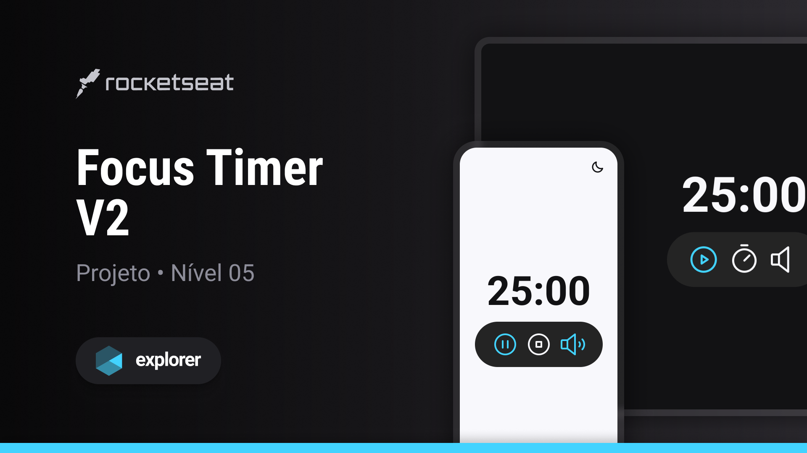

# Focus Timer Version 2

- [Phosphor icons](https://phosphoricons.com/)
- Screen Readers
- [Data Attributes](https://developer.mozilla.org/en-US/docs/Learn/HTML/Howto/Use_data_attributes)
- setTimeOut
- recurse()
- [Regular expressions](https://developer.mozilla.org/en-US/docs/Web/JavaScript/Guide/Regular_expressions)

